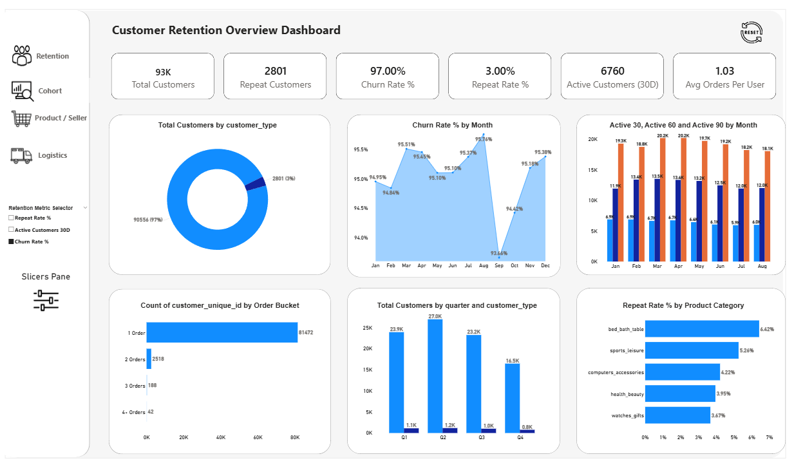
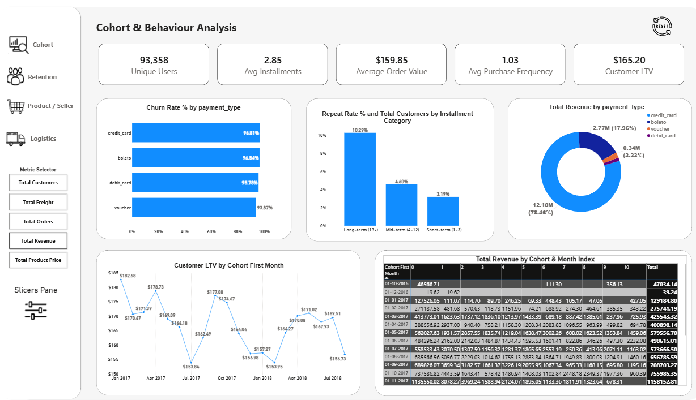
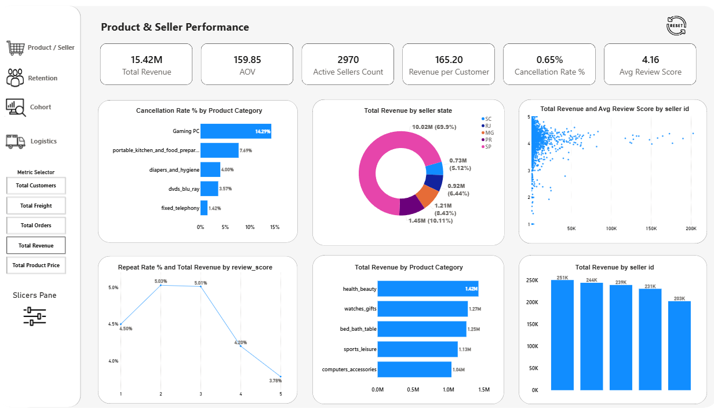
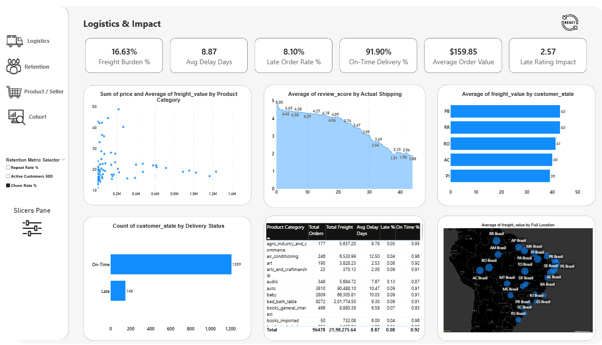

# 📊 User Retention & Business Decision Impact Analysis

**End-to-end SQL & Power BI Analysis of Customer Retention, Cohort Behaviour, Product Performance and Business Decision Impact**

---

## 📑 Table of Contents

* 📊 [Overview](#-overview)
* ❗ [Business Problem](#-business-problem)
* 📂 [Dataset](#-dataset)
* 🛠  [Tools & Technologies](#-tools--technologies)
* 📁 [Project Structure](#-project-structure)
* 🧹 [Data Cleaning & Preparation](#-data-cleaning--preparation)
* 🔍 [SQL Business Questions](#-sql-business-questions)
* 📊 [Dashboards](#-dashboards)
* 📌 [Key Insights](#-key-insights)
* ▶️ [How to Run This Project](#️-how-to-run-this-project)
* 🚀 [Final Recommendations](#-final-recommendations)
* 👤 [Author](#-author)

---

## 📊 Overview

**User Retention & Business Decision Impact Analysis** is a data analytics project built using the **Brazilian E-Commerce Public Dataset by Olist**.

The project focuses on understanding customer behaviour after their first purchase, analysing retention patterns, cohort behaviour, product performance, and identifying key factors that influence repeat purchases and long-term engagement.

The analysis is performed using **SQL (20 business questions)** and visualised through **Power BI dashboards**, while data ingestion and preprocessing were handled using **Python in Jupyter Notebook**.

---

## ❗ Business Problem

The business faces several challenges in understanding customer behaviour:

* Lack of clarity in customer retention and repeat purchase behaviour
* Difficulty identifying loyal vs one-time customers
* Limited understanding of customer lifecycle and cohort patterns
* Unclear contribution of customer segments to revenue
* High dependency on a small group of customers
* Lack of visibility into inactive and churned customers
* Limited understanding of delivery performance impact on retention
* Poor visibility into product category and payment behaviour influence
* Difficulty tracking active customer engagement trends
* Lack of structured insights into long-term customer value

---

## 📂 Dataset

**Dataset Used:** Brazilian E-Commerce Public Dataset by Olist

This dataset contains real-world e-commerce transaction data from 2016–2018.

### Dataset Tables (9 Total)

* Customers
* Orders
* Order Items
* Payments
* Products
* Sellers
* Reviews
* Geolocation
* Product Category Translation

### Notes

* Product category names were translated using the official Olist translation table
* Dataset is fully anonymised
* Suitable for customer behaviour, retention, and business performance analysis

---

## 🛠 Tools & Technologies

* Python (Jupyter Notebook) – Data ingestion & preprocessing
* pandas – Data cleaning & transformation
* SQL (PostgreSQL) – Data analysis & business queries
* psycopg2 & SQLAlchemy – Database connection
* Power BI – Dashboards & visualization

---

## 📁 Project Structure

```
User Retention & Business Decision Impact Analysis/
│
├── notebook/
│   └── olist_data_ingestion.ipynb
│
├── SQL Files/
│   ├── user_retention_data_cleaning.sql
│   └── user_retention_business_analysis.sql
│
├── PowerBI Dashboard
│   └── User_Retention_Business_Impact_Dashboard.pbix
│
├── Brazilian E-Commerce Public Dataset by Olist
│   ├── Customers
│   ├── Geolocation
│   ├── Order Items
│   ├── Order Payments
│   ├── Order Reviews
│   ├── Orders
│   ├── Products
│   ├── Sellers
│   └── Product Category Translation
│
├── Images/
│   ├── Overview.png
│   ├── Cohort.png
│   ├── Product.png
│   └── Logistics.png
│
├── Reports/
│   └── User_Retention_Analysis_Report.pdf
│
└── README.md
```

---

## 🧹 Data Cleaning & Preparation

* Missing product category values replaced with **"Unknown"**
* Product dimension nulls filled using **average values**
* City names cleaned using text standardization and unaccent function
* Created **city_clean column** for uniform location analysis
* Zip codes merged from customers, sellers, geolocation using UNION
* Built master location table with full coverage
* Latitude & longitude aggregated using AVG()
* Created **dim_geolocation table (one row per zip code)**
* Missing latitude/longitude replaced with 0
* Missing city → "Unknown", state → "N/A"
* Primary keys and foreign keys established
* Indexes created for performance optimization

---

## 🔍 SQL Business Questions (20)

Covers:

* Customer retention & repeat purchase behaviour
* Cohort-based lifecycle tracking
* Active vs inactive customer analysis
* Revenue contribution by customer segments
* High-value customer identification
* Churn risk analysis
* Product category performance
* Delivery performance impact on retention
* Payment method behaviour
* Order timing & operational insights
* Revenue distribution across customers

---

## 📊 Dashboards

### The project includes four Power BI dashboards:

### Customer Retention Overview Dashboard



### Cohort & Behaviour Analysis Dashboard



### Product & Seller Performance Dashboard



### Logistics & Impact Dashboard




### These dashboards provide complete visibility of customer behaviour, retention patterns, revenue distribution, product performance, and operational efficiency.

---

## 📌 Key Insights

* Most customers make only one purchase (very low retention)
* Repeat customers form a small portion of total user base
* Revenue is highly dependent on top high-value customers
* Customer engagement drops sharply after first purchase
* Cohort analysis shows steep Month 0 drop-off
* Delivery performance directly affects repeat behaviour
* Credit card and boleto dominate payment methods
* Some product categories show weak repeat purchase cycles
* High-value customers show increasing inactivity risk
* Overall growth is strong, but retention is weak

---


## ▶️ How to Run This Project

### 1. Clone the Repository
git clone https://github.com/praveenmono145-star/user-retention-business-impact-analysis.git  
user-retention-business-impact-analysis  

### 2. Run Python Notebook (Data Cleaning & Preprocessing)
Open and run all cells in:  
notebooks/olist_data_ingestion.ipynb  

This will perform data cleaning, preprocessing, and load processed data into PostgreSQL.

### 3. Setup PostgreSQL Database
Create a database (example: olist_db) and configure the PostgreSQL connection inside the notebook.  
Run the notebook to insert all processed tables into the database.

### 4. Run SQL Scripts (Business Analysis Layer)
Execute SQL files in the following order:  
sql/user_retention_data_cleaning.sql  
sql/user_retention_business_analysis.sql  

These scripts will generate all business insights and analytical outputs.

### 5. Open Power BI Dashboard
Open the dashboard file:  
dashboard/User_Retention_Business_Impact_Dashboard.pbix  

Then:
- Open in Power BI Desktop  
- Click Refresh  
- Ensure PostgreSQL connection is active  
- View dashboards and insights

---

## 🚀 Final Recommendations

* Improve first purchase experience to increase repeat rate
* Focus on converting one-time buyers into repeat customers
* Strengthen post-purchase engagement strategies
* Launch reactivation campaigns for high-value inactive customers
* Improve delivery consistency and reduce delays
* Use cohort analysis for continuous retention tracking
* Reduce dependency on a small set of high-value customers
* Improve low-performing product category retention
* Monitor customer behaviour regularly using dashboards
* Shift focus from acquisition-only to retention-driven growth

---

## 👤 Author

**Praveen S**
Aspiring Data Analyst

📧 Email: praveenmono145@gmail.com  
🔗 LinkedIn: https://www.linkedin.com/in/praveenmono26/